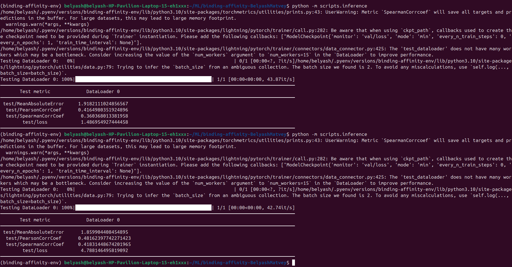
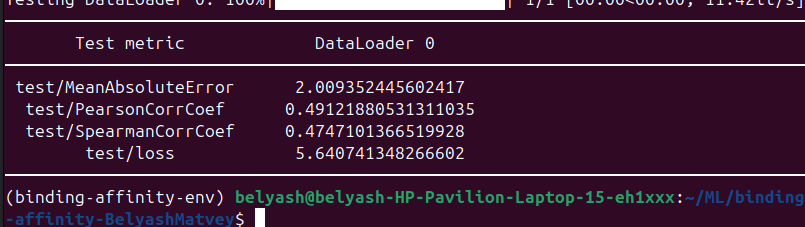
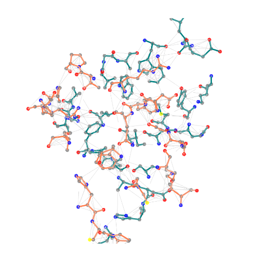

# Предсказание свободной энергии связывания

## Описание датасета
За основу датасета взят [SKEMPI v2.0](https://life.bsc.es/pid/skempi2), из структур комплекса оставлены атомы из интерфейса взаимодействия (находящиеся на расстоянии не более 4.0 ангстремов от белка-партнёра) и сохранены в JSON в следующем формате:
```python
[
    {
        "uid": "1ahw",           # RCSB PDB ID
        "interface_graph": {
            "coords": ...,       # координаты атомов, N x 3
            "atoms": ...,        # названия атомов, N
            "residues": ...,     # названия аминокислот, N
            "chain_ids": ...,    # идентификаторы полипептидных цепей, N
            "is_receptor": ...,  # 0 — атом относится к белку-рецептору, 1 — к белку-лиганду
        },
        "affinity": -12.0        # свободная энергия связывания
    }
]
```
Выборки лежат в папке `data`.

## Окружение

Для создания окружения использовался pyenv ввиду того, что дефолтная сборка _Poetry_ не позволяла собрать 
рабочее окружение. Для данного проекта использовался _Python 3.10.13_. Библиотеки, необходимые для запуска данного проекта
указаны в файле `requirements.txt` в папке `requirements`.

## Тренировка сети

После создания и активации виртуального окружения необходимо обучить модель. Настройка обучения происходит через
`train.yaml`.
Для этого можно использовать следующие команды:
```commandline
python -m scripts.train
```
Данная команда запустит обучение на модели *GraphNet* из _modules_. Для того чтобы запустить обучение на более 
усовершенствованной модели *InvariantGNN* необходимо добавить флаг `--config_name` с 
названием, куда передаем файл с конфигурацией (*train_invariant*):
```commandline
python -m scripts.train --config_name train_invariant
```

Также вы сможете посмотреть результаты в _TensorBoard_. Выглядеть это будет примерно так:

Также там будет множество других графиков которые вы можете по разному настроить.

## Тестирование сети

После обучения сети её необходимо протестировать. Можно тестировать как и *GraphNet*, 
так и *InvariantGNN*.

Пример вывода метрик для модели *GraphNet*.

Пример вывода метрик для модели *InvariantGNN*.


Запуск аналогичен c тренировкой:
```commandline
python -m scripts.inference
```
```commandline
python -m scripts.inference --config_name train_invariant
```

## Вывод примера

Для вывода примера достаточно через *Jupyter Notebook* запустить файл `interface_graph.ipynb`
и там последовательно запустить чанки для отображения структуры.

## Автор
Беляков Матвей